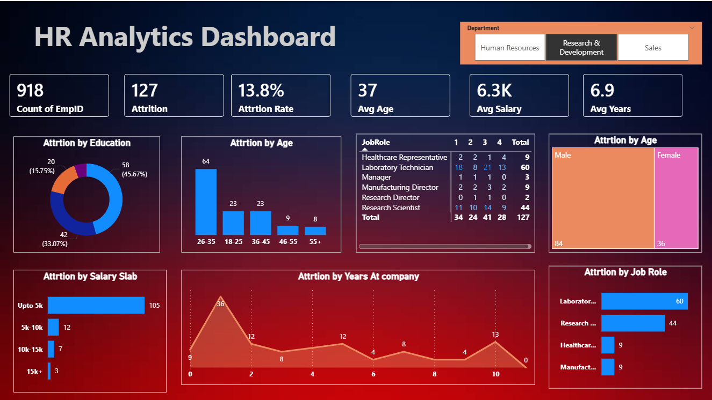

# 📊 Power BI Dashboards Portfolio

Welcome to my Power BI portfolio.

This repository contains interactive dashboards created using Power BI for business intelligence and data analysis.

---

## 🧑‍💼 HR Analytics Dashboard

### Overview
Developed an HR Analytics dashboard to analyze workforce trends, employee attrition, demographics, and key HR metrics.

### Tools Used
- Power BI
- Microsoft Excel
- DAX
- Power Query

### Key Insights
- Employee Attrition
- Department-wise Analysis
- Gender Distribution
- Age Group Analysis
- Job Satisfaction
- Salary Analysis

### Dashboard Preview

---

## 🛒 Retail Sales Dashboard

### Overview
Designed an interactive Retail Sales dashboard to monitor sales performance, profits, and regional trends.

### Tools Used
- Power BI
- Microsoft Excel
- DAX
- Power Query

### Key Insights
- Total Sales
- Total Profit
- Sales by Region
- Product Category Performance
- Monthly Sales Trends

### Dashboard Preview

---

## Skills Demonstrated

- Data Analytics
- Data Visualization
- Power BI
- DAX
- Power Query
- Microsoft Excel
- Dashboard Design

⭐ Thank you for visiting my portfolio!
